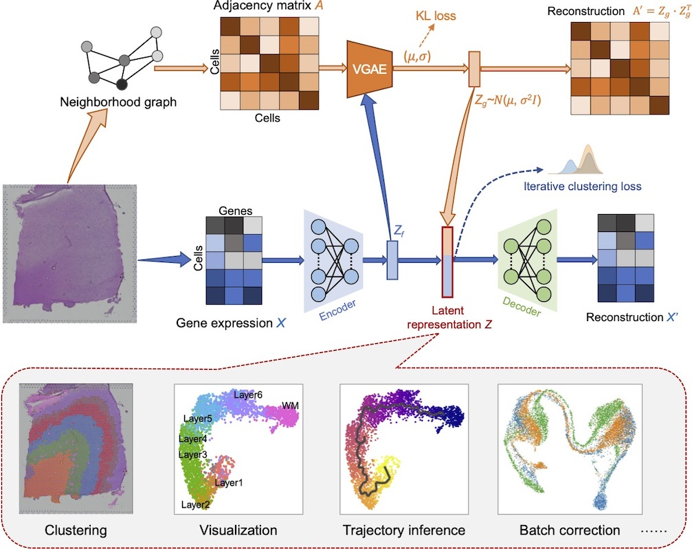
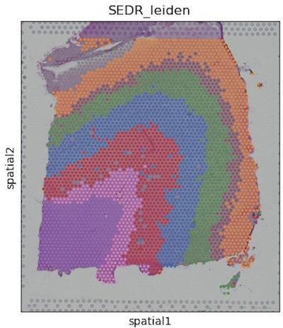
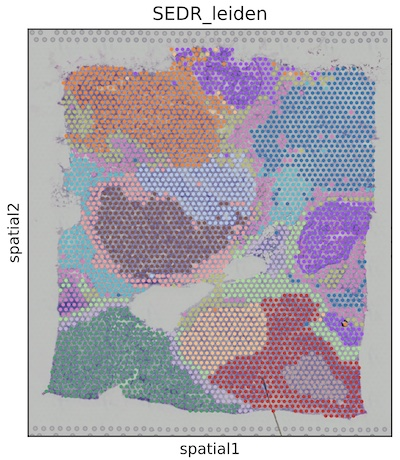
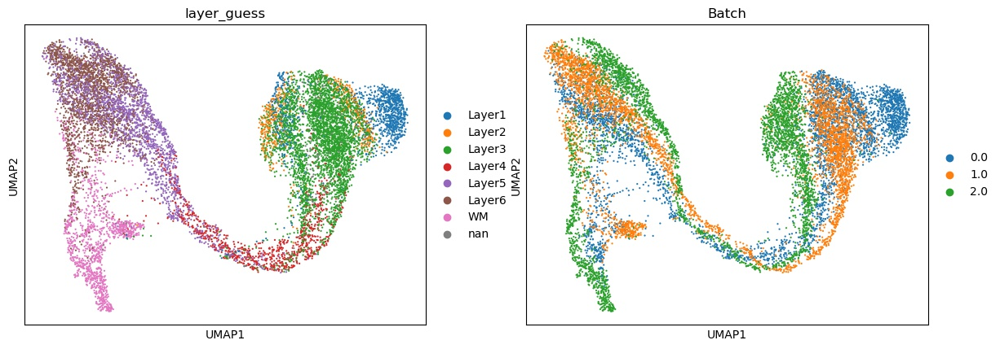

# SEDR: Unsupervised Spatial Embedded Deep Representation of Spatial Transcriptomics

## About:


__SEDR__ (spatial embedded deep representation)  learns a low-dimensional latent representation of gene expression embedded with spatial information for spatial transcriptomics analysis.  SEDR method consists of two main components, a deep autoencoder network for learning a gene representation, and a variational graph autoencoder network for embedding the spatial information.  SEDR has been applied on the 10x Genomics Visium spatial transcriptomics dataset as well as Stereo-seq dataset, and demonstrated its ability to achieve better representation for various follow-up analysis tasks including clustering, visualization, trajectory inference and batch effect correction.




## Installation:
 
SEDR is implemented in the pytorch framework (tested on Ubuntu 18.04, MacOS catalina with Python 3.8). Please run SEDR on CUDA if possible. The following packages are required to be able to run everything in this repository (included are the versions we used):

```bash
anndata==0.7.6 
bokeh==2.3.1
h5py==2.10.0
imageio==2.9.0   
leidenalg==0.8.4 
matplotlib==3.3.4 
numpy==1.20.2
python-igraph==0.9.1
python-louvain==0.15 
scanpy==1.7.2 
scikit-learn==0.24.1
scikit-network==0.23.1
scipy==1.6.3
seaborn==0.11.1
torch==1.8.1
torch-geometric==1.7.0 
torchvision==0.9.1
tqdm==4.59.0
umap-learn==0.5.1 
```

(**Recommended**) Using python virutal environment with conda（<https://anaconda.org/>）
```shell
conda create -n SEDR_Env python=3.8 pip
conda activate SEDR_Env
pip install -r requirements.txt
```
Time to install the requirements depends on the the running system, and it is about 30 minutes. There is no need to install SEDR, you can run the script directly. 


## Quick Start:

SDER utilizes anndata (based on *Scanpy*) as input, and outputs a latent representation, saved in `SED_result.npz`. User can extract the SEDR feature in **Python** as:
```shell
saved_result = np.load(os.path.join(save_path, "SED_result.npz"), allow_pickle=True)
sed_feat = saved_result["sed_feat"].item()
...
```
or in **R** with *'reticulate'* package as:
```shell
library(reticulate)
np <- import("numpy")
saved_result <- np$load("SED_result.npz")
sed_feat = saved_result$f[["sed_feat"]]
...
```


We also provide three examples:

1. `run_SEDR_DLPFC_all_data.py`: The demo code for *'LIBD human dorsolateral prefrontal cortex (DLPFC, <http://research.libd.org/spatialLIBD/>)'* data. The raw data are publicly available from the Globus endpoint ‘jhpce#HumanPilot10x’ that is also listed at <http://research.libd.org/globus>. It will take around 40 minutes to run all DLPFC samples on GPU.
   
   

2. `run_SEDR_10x_Genomics_Visium.py`: The demo code for *'Visium 10x Genomics'* data (<https://support.10xgenomics.com/spatial-gene-expression/datasets/1.1.0/V1_Breast_Cancer_Block_A_Section_1> ).
   
   


3. `run_UBC_DLPFC_data.py`: The demo code for unsupervised batch correction for multiple *DLPFC* data. 
   
   


**More scripts and evaluations could be found in** <https://github.com/JinmiaoChenLab/SEDR_analyses/>

## Citation:

**This repository contains the source code for the paper:**

[1] Huazhu Fu, Hang Xu, Kelvin Chong, Mengwei Li, Hong Kai Lee, Kok Siong Ang, Ao Chen, Ling Shao, Longqi Liu, and Jinmiao Chen, **"Unsupervised Spatial Embedded Deep Representation of Spatial Transcriptomics"**,  *bioRxiv* (2021). <https://www.biorxiv.org/content/10.1101/2021.06.15.448542>

**BibTeX**

```latex
@article{SEDR_2021,
	author = {Huazhu Fu, Hang Xu, Kelvin Chong, Mengwei Li, Hong Kai Lee, Kok Siong Ang, Ao Chen, Ling Shao, Longqi Liu, and Jinmiao Chen},
	title = {Unsupervised Spatial Embedded Deep Representation of Spatial Transcriptomics},
	year = {2021}, 
	journal = {bioRxiv},
	doi = {10.1101/2021.06.15.448542},
	URL = {https://www.biorxiv.org/content/10.1101/2021.06.15.448542},
}
```