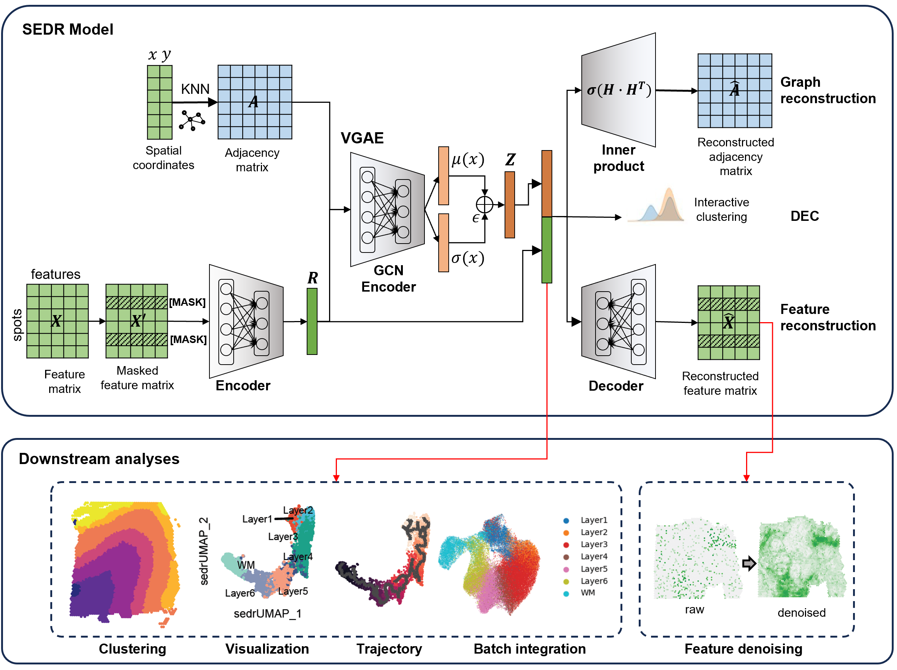

# SEDR: Unsupervised Spatial Embedded Deep Representation of Spatial Transcriptomics


## Overview:

__SEDR__ (spatial embedded deep representation) learns a low-dimensional latent representation of gene expression embedded with spatial information for spatial transcriptomics analysis. SEDR method consists of two main components, a deep autoencoder network with masked self-supervised mechanim for learning a gene representation, and a variational graph autoencoder network for embedding the spatial information. SEDR has been applied on the 10x Genomics Visium spatial transcriptomics dataset as well as Stereo-seq and Slide-seq dataset, and demonstrated its ability to achieve better representation for various follow-up analysis tasks including clustering, visualization, trajectory inference and batch effect correction.


## Requirements:
 
SEDR is implemented in the pytorch framework (tested on Ubuntu 18.04, MacOS catalina with Python 3.11.3). Please run SEDR on CUDA. The following packages are required to be able to run everything in this repository (included are the versions we used):

```bash
python==3.11.3
torch==2.0.1
cudnn==12.1
numpy==1.24.3
scanpy==1.9.3
anndata==0.9.1
ryp2==3.5.12
pandas==2.0.1
scipy==1.10.1
scikit-learn==1.2.2
tqdm==4.65.0
matplotlib==3.7.1
seaborn==0.12.2
R==4.0.3
```

## Tutorial
Tutorials can be found here:  https://sedr.readthedocs.io/en/latest/

## Citation:

**This repository contains the source code for the paper:**

[1] Huazhu Fu, Hang Xu, Kelvin Chong, Mengwei Li, Hong Kai Lee, Kok Siong Ang, Ao Chen, Ling Shao, Longqi Liu, and Jinmiao Chen, **"Unsupervised Spatial Embedded Deep Representation of Spatial Transcriptomics"**,  *bioRxiv* (2021). <https://www.biorxiv.org/content/10.1101/2021.06.15.448542>