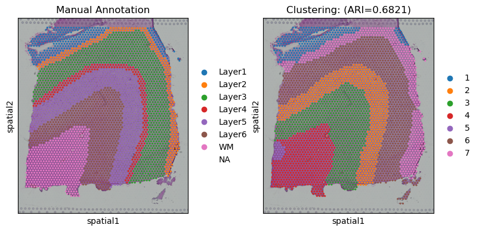
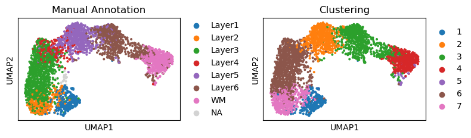

Tutorial 1: 10X Visium data
===========================

SEDR can be used to process 10X Visium data to extract low-dimension
representation. In this tutorial, we use sample #151673 from
Dorsolateral Prefrontal Cortex (DLPFC) dataset to introduce the analysis
pipeline.

The raw Visium data can be downloaded from
http://spatial.libd.org/spatialLIBD/.

Loading packages
----------------

.. code:: ipython3

    import scanpy as sc
    import pandas as pd
    from sklearn import metrics
    import torch
    
    import matplotlib.pyplot as plt
    import seaborn as sns
    
    import os
    from pathlib import Path
    import warnings
    warnings.filterwarnings('ignore')

.. code:: ipython3

    import SEDR

Setting parameters
------------------

random\_seed=2023 is used for reproducing the results in manuscript.

.. code:: ipython3

    random_seed = 2023
    SEDR.fix_seed(random_seed)

.. code:: ipython3

    # gpu
    device = 'cuda:0' if torch.cuda.is_available() else 'cpu'
    
    # path
    data_root = Path('../data/DLPFC')
    
    # sample name
    sample_name = '151673'
    n_clusters = 5 if sample_name in ['151669', '151670', '151671', '151672'] else 7

Loading data
------------

.. code:: ipython3

    adata = sc.read_visium(data_root / sample_name)
    adata.var_names_make_unique()
    
    df_meta = pd.read_csv(data_root / sample_name / 'metadata.tsv', sep='\t')
    adata.obs['layer_guess'] = df_meta['layer_guess']

Preprocessing
~~~~~~~~~~~~~

.. code:: ipython3

    adata.layers['count'] = adata.X.toarray()
    sc.pp.filter_genes(adata, min_cells=50)
    sc.pp.filter_genes(adata, min_counts=10)
    sc.pp.normalize_total(adata, target_sum=1e6)
    sc.pp.highly_variable_genes(adata, flavor="seurat_v3", layer='count', n_top_genes=2000)
    adata = adata[:, adata.var['highly_variable'] == True]
    sc.pp.scale(adata)
    
    from sklearn.decomposition import PCA  # sklearn PCA is used because PCA in scanpy is not stable. 
    adata_X = PCA(n_components=200, random_state=42).fit_transform(adata.X)
    adata.obsm['X_pca'] = adata_X

Constructing neighborhood graph
~~~~~~~~~~~~~~~~~~~~~~~~~~~~~~~

.. code:: ipython3

    graph_dict = SEDR.graph_construction(adata, 12)
    print(graph_dict)

.. parsed-literal::

    {'adj_norm': tensor(indices=tensor([[   0,  397,  485,  ..., 3402, 3564, 3638],
                           [   0,    0,    0,  ..., 3638, 3638, 3638]]),
           values=tensor([0.0769, 0.0769, 0.0769,  ..., 0.0769, 0.0769, 0.0769]),
           size=(3639, 3639), nnz=48471, layout=torch.sparse_coo), 'adj_label': tensor(indices=tensor([[   0,    0,    0,  ..., 3638, 3638, 3638],
                           [   0,  397,  485,  ..., 3402, 3564, 3638]]),
           values=tensor([1., 1., 1.,  ..., 1., 1., 1.]),
           size=(3639, 3639), nnz=48471, dtype=torch.float64,
           layout=torch.sparse_coo), 'norm_value': 0.501836878545686}

Training SEDR
~~~~~~~~~~~~~

.. code:: ipython3

    sedr_net = SEDR.Sedr(adata.obsm['X_pca'], graph_dict, mode='clustering', device=device)
    using_dec = True
    if using_dec:
        sedr_net.train_with_dec(N=1)
    else:
        sedr_net.train_without_dec(N=1)
    sedr_feat, _, _, _ = sedr_net.process()
    adata.obsm['SEDR'] = sedr_feat

.. parsed-literal::

    100%|██████████| 200/200 [00:07<00:00, 26.07it/s]
    100%|██████████| 200/200 [00:04<00:00, 49.32it/s]

Clustering
~~~~~~~~~~

.. code:: ipython3

    SEDR.mclust_R(adata, n_clusters, use_rep='SEDR', key_added='SEDR')

.. parsed-literal::

    R[write to console]:                    __           __ 
       ____ ___  _____/ /_  _______/ /_
      / __ `__ \/ ___/ / / / / ___/ __/
     / / / / / / /__/ / /_/ (__  ) /_  
    /_/ /_/ /_/\___/_/\__,_/____/\__/   version 6.0.0
    Type 'citation("mclust")' for citing this R package in publications.
    

.. parsed-literal::

    fitting ...
      |======================================================================| 100%

.. parsed-literal::

    AnnData object with n_obs × n_vars = 3639 × 2000
        obs: 'in_tissue', 'array_row', 'array_col', 'layer_guess', 'SEDR'
        var: 'gene_ids', 'feature_types', 'genome', 'n_cells', 'n_counts', 'highly_variable', 'highly_variable_rank', 'means', 'variances', 'variances_norm', 'mean', 'std'
        uns: 'spatial', 'hvg'
        obsm: 'spatial', 'X_pca', 'SEDR'
        layers: 'count'

Visualization
~~~~~~~~~~~~~

Spatial domain
^^^^^^^^^^^^^^

.. code:: ipython3

    sub_adata = adata[~pd.isnull(adata.obs['layer_guess'])]
    ARI = metrics.adjusted_rand_score(sub_adata.obs['layer_guess'], sub_adata.obs['SEDR'])
    
    fig, axes = plt.subplots(1,2,figsize=(4*2, 4))
    sc.pl.spatial(adata, color='layer_guess', ax=axes[0], show=False)
    sc.pl.spatial(adata, color='SEDR', ax=axes[1], show=False)
    axes[0].set_title('Manual Annotation')
    axes[1].set_title('Clustering: (ARI=%.4f)' % ARI)
    plt.tight_layout()
    plt.show()

UMAP
^^^^

.. code:: ipython3

    sc.pp.neighbors(adata, use_rep='SEDR', metric='cosine')
    sc.tl.umap(adata)
    
    fig, axes = plt.subplots(1,2,figsize=(4*2, 3))
    sc.pl.umap(adata, color='layer_guess', ax=axes[0], show=False)
    sc.pl.umap(adata, color='SEDR', ax=axes[1], show=False)
    axes[0].set_title('Manual Annotation')
    axes[1].set_title('Clustering')
    
    for ax in axes:
        ax.set_aspect(1)
        
    plt.tight_layout()
    plt.show()

