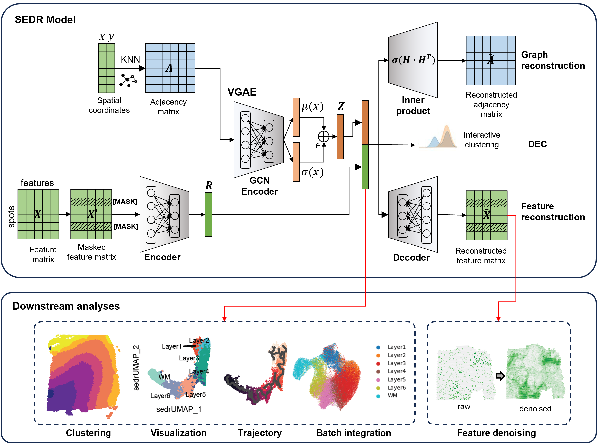

Welcome to SEDR's documentation!
===================================

SEDR – Unsupervised spatially embedded deep representation of spatial transcriptomics.
===============================================================================================

.. toctree::
    :maxdepth: 1

    Installation

Tutorials
=============

.. nbgallery::
    Tutorial1 Clustering
    Tutorial2 Imputation
    Tutorial3 Batch_integration
    Tutorial4 Stereo-seq

Overview
========
We present SEDR, an unsupervised spatially embedded deep representation of both transcript and spatial information. The SEDR pipeline uses a deep autoencoder coupled with a masked self-supervised learning mechanism to construct a low-dimensional latent representation of gene expression, which is then simultaneously embedded with the corresponding spatial information through a variational graph autoencoder.

Citation
========
Huazhu Fu, Hang Xu, Kelvin Chong, Mengwei Li, Hong Kai Lee, Kok Siong Ang, Ao Chen, Ling Shao, Longqi Liu, and Jinmiao Chen, "Unsupervised Spatial Embedded Deep Representation of Spatial Transcriptomics", bioRxiv (2021).